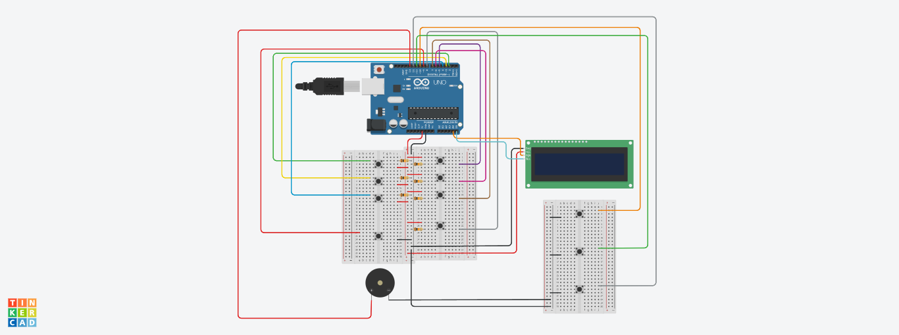

<h1 align="center">Braille-to-Text Converter for Assistive Communication</h1>

Electronic interface that converts Braille input patterns into readable text using Arduino.

<h2>Overview</h2>

Braille is a tactile writing system used by visually impaired individuals. Converting Braille input into readable text can improve accessibility and communication with digital systems.

This project implements an electronic system that converts Braille patterns entered using push buttons into alphanumeric text. The system processes the input using an <b>Arduino Uno</b> and displays the decoded characters on an <b>LCD display</b>.

The entire system was designed and simulated using <b>Autodesk Tinkercad</b>.

<h2>Objective</h2>

<ul>
<li>Provide an electronic interface for Braille input</li>
<li>Convert Braille patterns into readable text</li>
<li>Demonstrate assistive communication technology</li>
<li>Implement the system using microcontroller-based processing</li>
</ul>

<h2>Working Principle</h2>

Braille characters are formed using combinations of six dots arranged in a rectangular pattern. In this system, push buttons represent each Braille dot.

When the user presses a specific combination of buttons corresponding to a Braille character, the Arduino reads the input pattern and converts it into the equivalent alphabet or number. The decoded character is then displayed on the LCD screen.

<h2>Key Features</h2>

<ul>
<li>Braille input using push button interface</li>
<li>Real-time text conversion</li>
<li>LCD display output</li>
<li>Microcontroller-based pattern recognition</li>
<li>Simulation implemented in Autodesk Tinkercad</li>
</ul>

<h2>Tools and Technologies</h2>

<ul>
<li>Arduino Uno</li>
<li>Embedded C / Arduino IDE</li>
<li>Autodesk Tinkercad</li>
</ul>

<h2>System Components</h2>

<ul>
<li>Arduino Uno</li>
<li>Push buttons representing Braille dots</li>
<li>LCD display</li>
<li>Resistors</li>
<li>Power supply</li>
</ul>

<h2>Project Structure</h2>

<pre>
braille-to-text-converter
│
├── conversion_code.ino
├── circuit_view.png
├── circuit_with_label.png
├── schematic_view.pdf
└── README.md
</pre>

